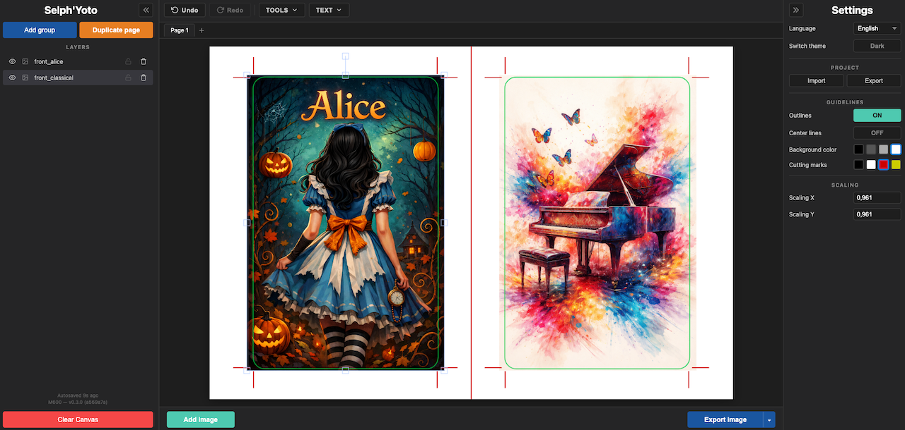
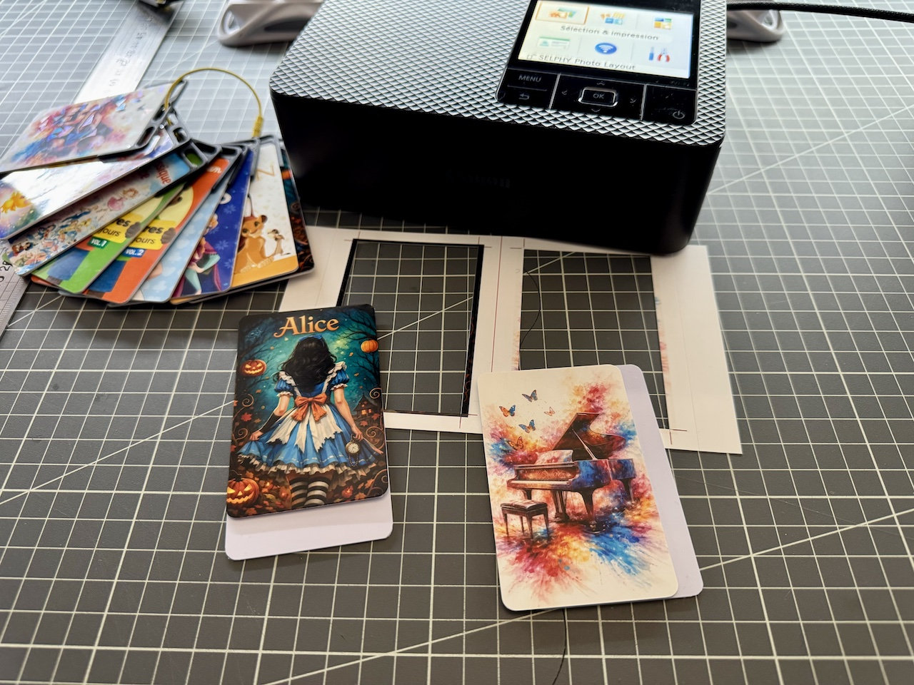

# Selph'Yoto - MYO label printing template for Selphy CP1500/CP1300


Available (for now) at: https://selphyoto.m600.fr

A web application for designing and printing precisely-sized YOTO card labels using a Canon Selphy CP1500 dye-sublimation printer with postcard paper (100 × 148 mm, borderless printing).




**100% client-side** — no data is ever sent to a server. All image processing happens in your browser.

## Features

- **Autosave** - Auto save locally, no need to worry
- **Project import and export** - Save a backup of your work or share it
- **Basic image manipulation** - Move, rotate, scale, mirror
- **Text tool** - Add text element
- **Layers** - Add multiple images, organize them in layers
- **Pages** - Ability to make multiple design at once
- **Duplicate** - Allow duplication of pages, useful when you do a serie

## Getting started

### Prerequisites

- [Bun](https://bun.sh) (latest)
- [Docker](https://www.docker.com/) (optional, for containerised builds)

### Install dependencies

```bash
# native
bun install
bunx playwright install chromium

# make
make install
```

### Run the dev server

```bash
# native
bunx vite

# make
make dev
```

Open `http://localhost:5173` in your browser. Changes are hot-reloaded.

### Build for production (without Docker)

```bash
# native
bun run build
bun run preview
```

The built files are output to the `dist/` directory. This is a fully static site that can be hosted anywhere.

## Testing

The project includes a comprehensive test suite across three layers: unit tests, integration tests, and end-to-end browser tests.

### Run all tests

```bash
# native
bun test && bunx playwright test --config tests/e2e/playwright.config.ts

# make
make tests
```

## Docker

### Build the Docker image

The commit hash is embedded into the app at build time via a build argument.

```bash
# native
docker build -t selphyoto --build-arg COMMIT_HASH=$(git rev-parse --short HEAD) .

# make
make build
```

### Run the container

```bash
# native
docker run -d -p 8080:80 --name selphyoto selphyoto

# make
make run
```

Open `http://localhost:8080` in your browser.

## Makefile reference

Run `make` (with no arguments) to see all available targets:

```
make help                Show this help
make install             Install dependencies and Playwright browsers
make install-playwright  Download Playwright browsers only (after upgrade)
make lint                Lint all TypeScript and JavaScript files (ESLint)
make lint-fix            Lint and auto-fix issues
make dev                 Start the Vite dev server (http://localhost:5173)
make unit-tests          Run unit tests only (bun:test)
make integration-tests   Run integration tests only (bun:test + happy-dom)
make e2e-tests           Run end-to-end tests (Playwright + Chromium)
make tests               Run the full test suite (unit + integration + e2e)
make tests-coverage      Run unit + integration tests with coverage report
make build               Build the Docker image (with embedded commit hash)
make run                 Run the Docker container (http://localhost:8080)
make stop                Stop and remove the Docker container
make clean               Remove node_modules and dist
make reinstall           Clean and reinstall everything
```

### Releasing a new version

1. Bump the `version` in `package.json` (e.g. `0.1.0` to `0.2.0`)
2. Commit and push to master/main
3. The workflow automatically creates a `v0.2.0` Git tag, a GitHub Release, and pushes the Docker image tagged `0.2.0` + `latest`

Every push to master/main also pushes a Docker image tagged with the branch name (e.g. `master`, `dev`). The `latest` and version tags are only updated when `package.json` contains a new version.

## Calibration workflow

The Selphy CP1500 enlarges images during borderless printing to avoid white edges. The correction factors compensate for this.

1. **Print a test** — export the template with default correction (0.9610) and print it borderless on postcard paper
2. **Measure** — use a ruler to measure the printed subframe dimensions (should be 54 mm wide, 85.6 mm tall)
3. **Calculate** — if the printed width is e.g. 55 mm: new Corr. X = `54 / 55 × current_corr_x`
4. **Update** — enter the new values in the Corr. X / Corr. Y fields in the toolbar
5. **Repeat** until the printed subframes match 54 × 85.6 mm

The correction values are saved in project exports, so you only need to calibrate once.

## Keyboard shortcuts

| Key | Action |
|-----|--------|
| Scroll wheel | Zoom selected image |
| Arrow keys | Nudge selected image (1px) |
| Delete / Backspace | Remove selected image (with confirmation) |

## Project structure

```
selphyoto/
├── index.html                  Entry HTML
├── package.json
├── tsconfig.json
├── vite.config.ts              Vite config (injects version + commit hash)
├── bunfig.toml                 Bun test configuration (preload, coverage)
├── Makefile                    Make targets for dev, test, build, run
├── Dockerfile                  Multi-stage build (Bun + nginx)
├── .dockerignore
├── .github/
│   └── workflows/
│       └── ci.yml              GitHub Actions CI/CD pipeline
├── src/
│   ├── main.ts                 Entry point, DOM event wiring, auto-save
│   ├── canvas-manager.ts       Fabric.js canvas, guides, export logic
│   ├── layer-manager.ts        Layer list UI and drag-and-drop
│   ├── project-io.ts           Project save/load (zip)
│   ├── auto-save.ts            IndexedDB auto-save
│   ├── utils.ts                Shared helpers (pad2, timestamp, sanitize)
│   ├── constants.ts            All dimensions, colors, and defaults
│   ├── style.css               Dark theme styles
│   └── vite-env.d.ts           Vite type declarations
├── tests/
│   ├── setup.ts                Bun test setup (happy-dom, global stubs)
│   ├── unit/
│   │   ├── constants.test.ts   Constant value validation
│   │   ├── utils.test.ts       Utility function tests
│   │   ├── canvas-manager.test.ts  CanvasManager with mocked Fabric.js
│   │   └── auto-save.test.ts   collectState() tests
│   ├── integration/
│   │   ├── layer-manager.test.ts   LayerManager DOM tests (happy-dom)
│   │   ├── project-roundtrip.test.ts  ZIP import/export roundtrip
│   │   └── auto-save-idb.test.ts  IndexedDB operations (fake-indexeddb)
│   └── e2e/
│       ├── playwright.config.ts    Playwright config
│       └── app.spec.ts             Full browser tests
├── research.md                 Research notes and calibration data
└── agents.md                   LLM context file
```

## Technical details

| Spec | Value |
|------|-------|
| Postcard size | 148 × 100 mm (borderless) |
| YOTO card size | 54 × 85.6 mm |
| Corner radius | 3.18 mm |
| Print DPI | 300 (11.811 px/mm) |
| Export resolution | 1748 × 1181 px |
| Canvas library | Fabric.js v7 |
| Build tool | Vite |
| Runtime | Bun |
| Language | TypeScript |
| Unit/Integration tests | bun:test + happy-dom + fake-indexeddb |
| E2E tests | Playwright (Chromium) |
